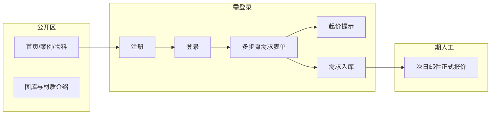

# 02 — 功能需求

## 1. 功能总览

## 2. 公开页面（无需登录）

### 2.1 首页

- **Hero**：大图 + 价值主张（类似参考代码的全屏视觉）  
- **能力区块**：发光字、亚克力、铝型材、安装服务等简述  
- **系统/产品线介绍**：展示 4 类 Logo 产品：不发光 logo、发光 logo、lightbox、侧面安装 logo  
- **案例精选**（References）：网格卡片，点击进入详情或灯箱  
- **流程说明**：填写需求 → 起价参考 → 人工报价邮件 → 生产/物流（对标竞品「So funktioniert's」）  
- **CTA**：「开始配置 / 获取报价」→ 引导注册或登录  

### 2.2 案例与图库（Gallery）

- 分类筛选：如亚克力、铝型材、不锈钢、照明方案等（对齐竞品「All Works / Acryl / Aluminium…」）  
- 每项：标题、主图、可选简短说明、材质/型材标签  
- 一期可为 **静态 + 数据库 `gallery_items`**，后台录入可二期  

### 2.3 物料 / 产品介绍（Catalog 轻量版）

- 不必一期做完整电商「加入购物车」  
- 以 **教育性目录** 为主：产品名、描述、典型尺寸、材质说明、示意图  
- 参考示例 `ProductCard`：编号、collection、specs、描述；**价格一期可隐藏或仅显示「询价」**  

### 2.4 联系 / 页脚

- 公司信息、营业时间、邮箱、地址（可对标竞品支持时段）  
- 法律页：Impressum、Datenschutz、Cookie（若面向德国用户）  

## 3. 账户体系（一期必做）

### 3.1 注册

- 字段建议：`email`、`password`（强度校验）、可选 `company_name`、`phone`  
- 邮箱唯一；**注册成功后立即登录**，一期 **不发送** 验证邮件、不要求点击激活链接  
- 密码存储：bcrypt/argon2 等，禁止明文  

### 3.2 登录 / 登出

- Session 或 JWT（实现阶段选定）  
- 「忘记密码」可列为二期  

### 3.3 用户中心（最小）

- 查看已提交的询价列表（关联 `quotes`）  
- 每条显示：提交时间、状态、起价提示、备注「正式报价将邮件发送」  

## 4. 需求收集与「起价」（一期核心）

### 4.1 多步骤向导（按产品类型动态分支）

基础步骤：

| 步骤 | 内容 |
|------|------|
| 1 | 项目类型：不发光 logo、发光 logo、lightbox、侧面安装 logo |
| 2 | 尺寸（宽×高×深或直径）、数量 |
| 3 | 材质（根据产品类型显示主体材料、包边材料、侧边材料、前面覆盖材料等） |
| 4 | 照明（仅发光类产品显示：发光方式、色温、亮度） |
| 5 | Logo 样式：上传图片 / 矢量 / 参考链接 |
| 6 | 安装与地址：是否需安装、室内/室外安装场景、安装方式、国家/邮编（影响运费估算文案） |
| 7 | 确认汇总 + 展示 **「ab € xxx」起价** + 提交 |

- UI：**面包屑 / 步骤条**，上一步下一步，最后确认页  
- 关键选择项以 **图片卡片** 展示，类似餐馆点菜：材料、发光方式、色温、亮度、安装方式都配代表性案例图，帮助客户直观看懂差异  
- 提交后：创建 `quotes`，完整多步骤表单写入 `form_payload`，上传文件元数据写入 `quote_files`  

#### 4.1.1 产品类型分支规则

| 产品类型 | 材料逻辑 | 灯光逻辑 | 安装逻辑 |
|----------|----------|----------|----------|
| 不发光 Logo | 主体材料：木头喷漆、亚克力、铝塑板 | 跳过照明步骤 | 室内/室外；单个字母安装、条形支撑安装、Logo 背板安装 |
| 发光 Logo | 主体默认亚克力；包边材质：亚克力、铝塑板、不锈钢 | 发光方式：背光、正面发光、侧面发光；色温：3000K、4500K、6000K；亮度：低/中/高 | 室内/室外；单个字母安装、条形支撑安装、Logo 背板安装 |
| Lightbox | 侧边材料：不锈钢、铝塑板、亚克力；前面覆盖材料：布、亚克力 | 色温：3000K、4500K、6000K；亮度：低/中/高 | 室内/室外 |
| 侧面安装 Logo | 侧边材料：不锈钢、铝塑板、亚克力；前面覆盖材料：布、亚克力 | 色温：3000K、4500K、6000K；亮度：低/中/高 | 室内/室外；金属杆支撑安装、整体贴墙安装 |

### 4.2 起价逻辑（一期简化）

- **非正式报价**，文案需明确：「Vorläufige Richtpreis / Indicative starting price」  
- 实现方式示例（择一或组合）：  
  - 按材质/尺寸档位的 **最低展示价** 查表（可写死在配置或少量 DB 行）  
  - 或全局固定「ab € 299」类营销起价  
- **不**在一期对接工厂实时价、物流 API  

### 4.3 提交后体验

- 成功页：感谢提交、预计 **1 个工作日内** 邮件联系  
- **不**自动发含详细价格的客户邮件（一期）  
- 可选：内部通知邮件/Webhook（二期）  

## 5. 明确不做（一期）

| 功能 | 说明 |
|------|------|
| 完整定价引擎 | 材料费 + 运费 + 利润自动汇总 |
| 客户报价 PDF | 生成与下载 |
| 自动报价邮件 | 含 HD 可视化等 |
| 管理后台 CRUD | 价格、规则、产品在线维护 |
| Excel 自动同步 | 供应商价格表导入 |
| 在线支付 | — |

## 6. 二期功能 backlog（记录愿景）

1. **Admin 面板**：`products`、`pricing_rules`、配送选项、毛利率配置  
2. **规则引擎**：条件 + modifier（如 `condition` + `modifier` 表）  
3. **报价计算**：读取工厂材料、物流、安装费  
4. **PDF / 邮件**：模板化报价单与可视化附件  
5. **多角色**：销售、工厂、只读客户  
6. **扩展语言 / SEO**：第三语言、结构化数据、sitemap（一期仅 EN+DE）  

## 7. 国际化（i18n）

- **语言**：**英语（en）** 与 **德语（de）**  
- **默认**：首次访问为 **德语（de）**；未保存偏好时不按浏览器语言覆盖默认  
- **切换**：全站顶栏或页脚提供语言切换；选择持久化（`localStorage` 或 cookie），下次访问沿用用户选择  
- **实现建议**：`next-intl` / `react-i18nnext` 等；文案放在 `locales/en.json`、`locales/de.json`  
- **范围**：导航、按钮、表单、校验错误、起价与成功页说明；法律页（Impressum/Datenschutz）建议双语各一份  
- **技术规格**：尺寸（mm）、色温（4000K）、RAL 等可保持国际通用写法，不必翻译  
- **邮件**（人工报价）：运营可按客户注册地区或表单语言用 DE/EN 回复（站外流程）  

## 8. 非功能需求

- **响应式**：移动端可用（参考代码含移动菜单）  
- **性能**：首屏图片 lazy load、WebP 可选  
- **安全**：HTTPS、CSRF、上传文件类型与大小限制、防暴力登录  
- **合规**：GDPR 同意、隐私政策、数据导出/删除请求流程（可简版）  
- **可维护**：定价与文案尽量 **配置化**，为二期 Admin 留扩展点  
