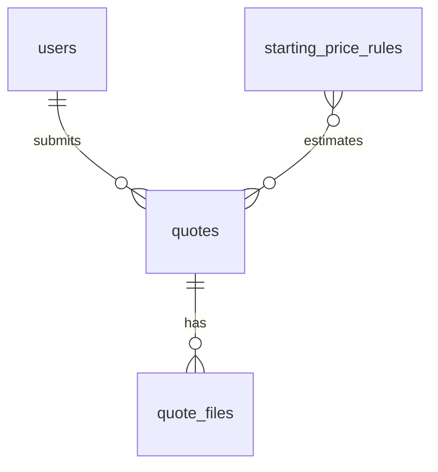

# 05 — 数据库与数据模型

## 1. 设计原则

一期数据库只服务 **客户账户、询价需求收集、文件上传、案例/物料展示、起价提示**。正式报价仍由人工完成，因此不要把一期 schema 设计成完整报价系统。

核心原则：

- **功能优先于最终范式**：一期先保证注册、登录、询价入库可稳定运行
- **保留灵活性**：多步骤表单字段可能继续变化，使用 `quotes.form_payload` 保存完整快照
- **双语从一开始支持**：展示内容直接预留 `*_en` / `*_de`
- **文件不进数据库**：数据库只存上传文件路径和元数据
- **起价不是正式报价**：使用 `starting_price_rules`，不提前实现复杂 `pricing_rules`

## 2. 一期推荐表

一期建议落地以下 6 张核心表：

| 表 | 用途 |
|----|------|
| `users` | 客户账户、登录凭证、语言偏好 |
| `quotes` | 一次客户询价请求 |
| `quote_files` | 客户上传的 Logo、参考图、现场图 |
| `products` | 物料/产品介绍，服务前端 catalog |
| `gallery_items` | 案例与图库展示 |
| `starting_price_rules` | 简单起价规则，如 `from €299` |

`quote_items`、`pricing_rules`、`shipping_rates`、`installation_rates` 等表可放到二期，在真正做自动报价和后台规则维护时再加入。

## 3. 实体关系（概念）



展示内容 `products`、`gallery_items` 与客户询价没有强绑定关系，一期可独立维护。

## 4. 表定义

### 4.1 `users`

存客户账户。注册暂时不需要邮箱验证，注册成功即可登录。

| 字段 | 类型建议 | 说明 |
|------|----------|------|
| `id` | BIGINT PK AI | 主键 |
| `email` | VARCHAR(255) UNIQUE NOT NULL | 登录邮箱 |
| `password_hash` | VARCHAR(255) NOT NULL | 哈希后的密码，禁止明文 |
| `company_name` | VARCHAR(255) NULL | 公司名 |
| `contact_name` | VARCHAR(255) NULL | 联系人 |
| `phone` | VARCHAR(50) NULL | 电话 |
| `preferred_locale` | VARCHAR(8) DEFAULT 'en' | 用户语言偏好，`en` / `de` |
| `created_at` | DATETIME | 注册时间 |
| `updated_at` | DATETIME | 更新时间 |
| `last_login_at` | DATETIME NULL | 最近登录时间 |

### 4.2 `quotes`

存一次客户提交的询价请求。它不是订单，也不是正式报价单。

| 字段 | 类型建议 | 说明 |
|------|----------|------|
| `id` | BIGINT PK AI | 内部主键 |
| `quote_number` | VARCHAR(32) UNIQUE | 给客户看的编号，如 `Q-20260527-0001` |
| `user_id` | BIGINT FK → users.id | 提交用户 |
| `status` | VARCHAR(32) DEFAULT 'submitted' | `submitted` / `reviewing` / `quoted` / `closed` |
| `project_type` | VARCHAR(64) NULL | 项目类型，如 facade_logo / indoor_logo / lightbox |
| `indicative_price` | DECIMAL(12,2) NULL | 起价数字，仅作参考 |
| `indicative_price_label` | VARCHAR(64) NULL | 展示文案，如 `from €299` / `ab €299` |
| `locale` | VARCHAR(8) DEFAULT 'en' | 提交时使用的界面语言 |
| `customer_notes` | TEXT NULL | 客户备注 |
| `form_payload` | JSON NULL | 完整多步骤表单快照 |
| `created_at` | DATETIME | 提交时间 |
| `updated_at` | DATETIME | 更新时间 |
| `quoted_at` | DATETIME NULL | 人工正式报价时间 |

`form_payload` 建议保存如下信息：

```json
{
  "applicationType": "facade_logo",
  "dimensions": {
    "widthMm": 1200,
    "heightMm": 400,
    "depthMm": 80
  },
  "quantity": 1,
  "material": "acrylic",
  "lightingType": "backlit",
  "colorTemperature": "4000K",
  "installation": {
    "needed": true,
    "country": "DE",
    "postalCode": "10115",
    "city": "Berlin"
  }
}
```

### 4.3 `quote_files`

存客户上传文件的元数据。实际文件存本地 `/uploads` 或后续对象存储。

| 字段 | 类型建议 | 说明 |
|------|----------|------|
| `id` | BIGINT PK AI | 主键 |
| `quote_id` | BIGINT FK → quotes.id | 所属询价 |
| `file_name` | VARCHAR(255) | 服务端保存文件名 |
| `original_name` | VARCHAR(255) | 客户原始文件名 |
| `mime_type` | VARCHAR(128) | MIME 类型 |
| `file_size` | BIGINT | 文件大小，单位 byte |
| `file_path` | VARCHAR(512) | 文件路径或对象存储 key |
| `file_role` | VARCHAR(32) | `logo` / `reference` / `site_photo` / `other` |
| `created_at` | DATETIME | 上传时间 |

### 4.4 `products`

存物料介绍，不等同于电商 SKU。一期主要用于前端 catalog / materials 页面。

| 字段 | 类型建议 | 说明 |
|------|----------|------|
| `id` | BIGINT PK AI | 主键 |
| `slug` | VARCHAR(128) UNIQUE | URL 或内部识别 |
| `name_en` | VARCHAR(255) | 英文名称 |
| `name_de` | VARCHAR(255) | 德文名称 |
| `description_en` | TEXT | 英文描述 |
| `description_de` | TEXT | 德文描述 |
| `category` | VARCHAR(64) | 分类，如 acrylic / aluminium / lightbox |
| `material` | VARCHAR(128) NULL | 材质 |
| `base_price` | DECIMAL(12,2) NULL | 展示起价或参考价，不代表正式报价 |
| `image_url` | VARCHAR(512) NULL | 主图 |
| `specs_json` | JSON NULL | 规格，如尺寸、色温、工艺 |
| `active` | TINYINT(1) DEFAULT 1 | 是否显示 |
| `sort_order` | INT DEFAULT 0 | 排序 |
| `created_at` | DATETIME | 创建时间 |
| `updated_at` | DATETIME | 更新时间 |

### 4.5 `gallery_items`

存案例与图库内容。

| 字段 | 类型建议 | 说明 |
|------|----------|------|
| `id` | BIGINT PK AI | 主键 |
| `title_en` | VARCHAR(255) | 英文标题 |
| `title_de` | VARCHAR(255) | 德文标题 |
| `description_en` | TEXT NULL | 英文描述 |
| `description_de` | TEXT NULL | 德文描述 |
| `image_url` | VARCHAR(512) | 图片 URL |
| `category` | VARCHAR(64) | 分类，如 acryl / aluminium / stainless / lightbox |
| `published` | TINYINT(1) DEFAULT 1 | 是否发布 |
| `sort_order` | INT DEFAULT 0 | 排序 |
| `created_at` | DATETIME | 创建时间 |
| `updated_at` | DATETIME | 更新时间 |

### 4.6 `starting_price_rules`

存一期「起价」规则。它只用于展示 `from €xxx`，不用于正式报价。

| 字段 | 类型建议 | 说明 |
|------|----------|------|
| `id` | BIGINT PK AI | 主键 |
| `name` | VARCHAR(128) | 规则名称 |
| `project_type` | VARCHAR(64) NULL | 项目类型 |
| `material` | VARCHAR(128) NULL | 材质 |
| `min_width_mm` | INT NULL | 最小宽度 |
| `max_width_mm` | INT NULL | 最大宽度 |
| `min_height_mm` | INT NULL | 最小高度 |
| `max_height_mm` | INT NULL | 最大高度 |
| `starting_price` | DECIMAL(12,2) | 起价数字 |
| `currency` | CHAR(3) DEFAULT 'EUR' | 币种 |
| `active` | TINYINT(1) DEFAULT 1 | 是否启用 |
| `sort_order` | INT DEFAULT 0 | 匹配优先级，越小越优先 |
| `created_at` | DATETIME | 创建时间 |
| `updated_at` | DATETIME | 更新时间 |

## 5. 初版 DDL 示例（MySQL 8）

```sql
CREATE DATABASE IF NOT EXISTS logo_portal
  CHARACTER SET utf8mb4
  COLLATE utf8mb4_unicode_ci;

USE logo_portal;

CREATE TABLE users (
  id BIGINT UNSIGNED AUTO_INCREMENT PRIMARY KEY,
  email VARCHAR(255) NOT NULL UNIQUE,
  password_hash VARCHAR(255) NOT NULL,
  company_name VARCHAR(255) NULL,
  contact_name VARCHAR(255) NULL,
  phone VARCHAR(50) NULL,
  preferred_locale VARCHAR(8) NOT NULL DEFAULT 'en',
  created_at DATETIME NOT NULL DEFAULT CURRENT_TIMESTAMP,
  updated_at DATETIME NOT NULL DEFAULT CURRENT_TIMESTAMP ON UPDATE CURRENT_TIMESTAMP,
  last_login_at DATETIME NULL
) ENGINE=InnoDB;

CREATE TABLE quotes (
  id BIGINT UNSIGNED AUTO_INCREMENT PRIMARY KEY,
  quote_number VARCHAR(32) NOT NULL UNIQUE,
  user_id BIGINT UNSIGNED NOT NULL,
  status VARCHAR(32) NOT NULL DEFAULT 'submitted',
  project_type VARCHAR(64) NULL,
  indicative_price DECIMAL(12,2) NULL,
  indicative_price_label VARCHAR(64) NULL,
  locale VARCHAR(8) NOT NULL DEFAULT 'en',
  customer_notes TEXT NULL,
  form_payload JSON NULL,
  created_at DATETIME NOT NULL DEFAULT CURRENT_TIMESTAMP,
  updated_at DATETIME NOT NULL DEFAULT CURRENT_TIMESTAMP ON UPDATE CURRENT_TIMESTAMP,
  quoted_at DATETIME NULL,
  CONSTRAINT fk_quotes_user FOREIGN KEY (user_id) REFERENCES users(id),
  INDEX idx_quotes_user_created (user_id, created_at),
  INDEX idx_quotes_status_created (status, created_at)
) ENGINE=InnoDB;

CREATE TABLE quote_files (
  id BIGINT UNSIGNED AUTO_INCREMENT PRIMARY KEY,
  quote_id BIGINT UNSIGNED NOT NULL,
  file_name VARCHAR(255) NOT NULL,
  original_name VARCHAR(255) NOT NULL,
  mime_type VARCHAR(128) NOT NULL,
  file_size BIGINT UNSIGNED NOT NULL,
  file_path VARCHAR(512) NOT NULL,
  file_role VARCHAR(32) NOT NULL DEFAULT 'other',
  created_at DATETIME NOT NULL DEFAULT CURRENT_TIMESTAMP,
  CONSTRAINT fk_quote_files_quote FOREIGN KEY (quote_id) REFERENCES quotes(id) ON DELETE CASCADE,
  INDEX idx_quote_files_quote (quote_id)
) ENGINE=InnoDB;

CREATE TABLE products (
  id BIGINT UNSIGNED AUTO_INCREMENT PRIMARY KEY,
  slug VARCHAR(128) NOT NULL UNIQUE,
  name_en VARCHAR(255) NOT NULL,
  name_de VARCHAR(255) NOT NULL,
  description_en TEXT NULL,
  description_de TEXT NULL,
  category VARCHAR(64) NOT NULL,
  material VARCHAR(128) NULL,
  base_price DECIMAL(12,2) NULL,
  image_url VARCHAR(512) NULL,
  specs_json JSON NULL,
  active TINYINT(1) NOT NULL DEFAULT 1,
  sort_order INT NOT NULL DEFAULT 0,
  created_at DATETIME NOT NULL DEFAULT CURRENT_TIMESTAMP,
  updated_at DATETIME NOT NULL DEFAULT CURRENT_TIMESTAMP ON UPDATE CURRENT_TIMESTAMP,
  INDEX idx_products_category_active (category, active),
  INDEX idx_products_sort (sort_order)
) ENGINE=InnoDB;

CREATE TABLE gallery_items (
  id BIGINT UNSIGNED AUTO_INCREMENT PRIMARY KEY,
  title_en VARCHAR(255) NOT NULL,
  title_de VARCHAR(255) NOT NULL,
  description_en TEXT NULL,
  description_de TEXT NULL,
  image_url VARCHAR(512) NOT NULL,
  category VARCHAR(64) NULL,
  published TINYINT(1) NOT NULL DEFAULT 1,
  sort_order INT NOT NULL DEFAULT 0,
  created_at DATETIME NOT NULL DEFAULT CURRENT_TIMESTAMP,
  updated_at DATETIME NOT NULL DEFAULT CURRENT_TIMESTAMP ON UPDATE CURRENT_TIMESTAMP,
  INDEX idx_gallery_category_published (category, published),
  INDEX idx_gallery_sort (sort_order)
) ENGINE=InnoDB;

CREATE TABLE starting_price_rules (
  id BIGINT UNSIGNED AUTO_INCREMENT PRIMARY KEY,
  name VARCHAR(128) NOT NULL,
  project_type VARCHAR(64) NULL,
  material VARCHAR(128) NULL,
  min_width_mm INT NULL,
  max_width_mm INT NULL,
  min_height_mm INT NULL,
  max_height_mm INT NULL,
  starting_price DECIMAL(12,2) NOT NULL,
  currency CHAR(3) NOT NULL DEFAULT 'EUR',
  active TINYINT(1) NOT NULL DEFAULT 1,
  sort_order INT NOT NULL DEFAULT 0,
  created_at DATETIME NOT NULL DEFAULT CURRENT_TIMESTAMP,
  updated_at DATETIME NOT NULL DEFAULT CURRENT_TIMESTAMP ON UPDATE CURRENT_TIMESTAMP,
  INDEX idx_spr_lookup (active, project_type, material, sort_order)
) ENGINE=InnoDB;
```

## 6. 起价计算方式（一期）

一期只做「非约束性起价」：

1. 根据表单中的 `project_type`、`material`、尺寸范围查 `starting_price_rules`
2. 取 `active = 1` 且匹配条件最合适的规则
3. 生成 `indicative_price` 与 `indicative_price_label`
4. 保存到 `quotes`

示例展示：

- 英文：`from €299`
- 德文：`ab €299`

正式报价仍由人工计算材料、物流、安装和利润后通过邮件发送。

## 7. 一期数据流

1. 用户注册 → `INSERT users`，密码写入 `password_hash`
2. 用户登录 → 建立 session，更新 `last_login_at`
3. 用户填写多步骤询价 → 上传文件写入 `quote_files`
4. 服务端生成起价 → `INSERT quotes`
5. 用户中心读取 `quotes` 列表
6. 运营人工处理后，可手动更新 `quotes.status`、`indicative_price` 或后续扩展正式报价字段

## 8. 与 Excel 价格表的关系

- 当前供应商/物流价格仍来自 Excel
- 一期不要求自动导入 Excel
- 如需展示起价，可手动把少量起价档位录入 `starting_price_rules`
- 二期如果要自动化，可新增：
  - `pricing_rules`
  - `shipping_zones`
  - `shipping_rates`
  - `installation_rates`
  - `supplier_price_imports`

## 9. 二期可扩展表

当需要管理后台和自动报价时，可新增：

| 表 | 用途 |
|----|------|
| `admin_users` | 后台账号与权限 |
| `pricing_rules` | 正式报价规则 |
| `shipping_rates` | 运输价格 |
| `installation_rates` | 安装价格 |
| `quote_messages` | 销售与客户沟通记录 |
| `email_logs` | 自动邮件记录 |
| `quote_pdf_files` | PDF 报价单文件 |
| `supplier_price_imports` | Excel / CSV 导入记录 |

## 10. 迁移说明

本机与服务器应使用同一份 schema 或迁移文件。推荐后续创建：

```text
database/
  schema.sql
  seed.sql
```

当 schema 演进时：

1. 在本机或 staging 验证迁移脚本
2. 备份生产数据库
3. 执行迁移
4. 同步 ORM 模型与应用代码

客户已表示结构可自行调整，**功能逻辑与用户流程优先于字段冻结**。
