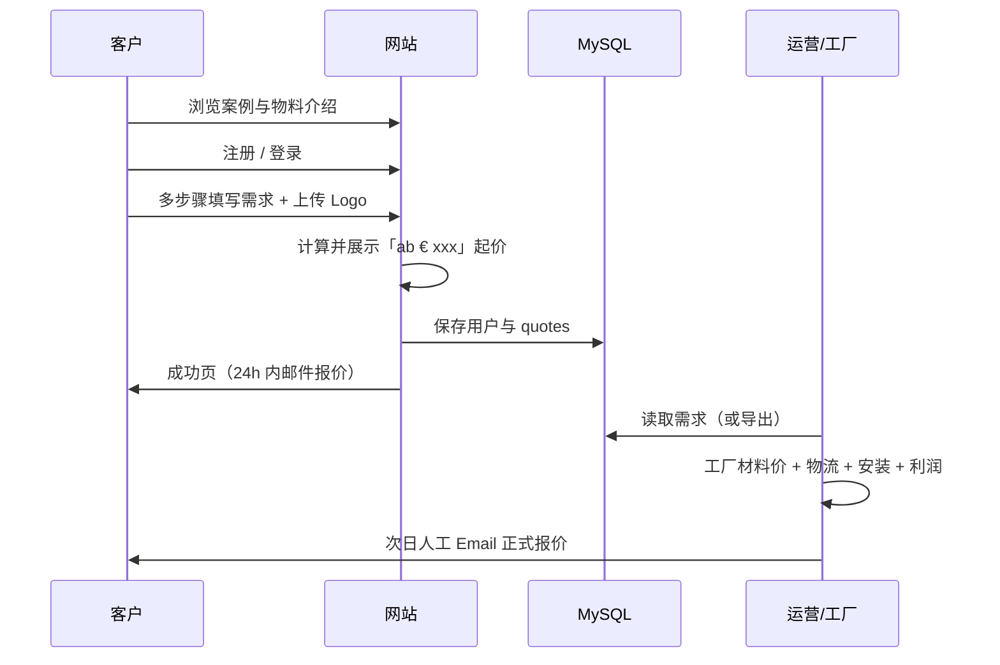

# 06 — 用户流程与信息收集

## 1. 端到端流程（一期）



与早期愿景的差异：

| 早期愿景 | 一期实际 |
|----------|----------|
| 算法即时生成正式报价 | 仅 **起价** 提示 |
| 网站自动发报价邮件 | **人工** 发邮件 |
| 网站 = 报价引擎 | 网站 = **信息收集 + 账户** 门户 |

## 2. 访客路径

### 路径 A：仅浏览

1. 进入首页 → 查看 References / Gallery / Catalog  
2. 点击 CTA → 若未登录，跳转 **注册**  

### 路径 B：询价（主路径）

1. **注册**（邮箱 + 密码 + 可选公司名）→ **无需邮箱验证**，成功后直接进入已登录状态  
2. **登录**（已注册用户）  
3. 进入 **询价向导**（`/quote`）  
4. 逐步填写（见下表）  
5. 确认页 → 显示起价 + 提交  
6. **成功页** + 账户内可查看历史记录  

## 3. 多步骤表单字段（建议）

| 步骤 | 字段 | 必填 | 存储建议 |
|------|------|------|----------|
| 1 场景 | `application_type`（门头/室内/交付区/其他） | 是 | `form_payload` |
| 2 尺寸 | `width_mm`, `height_mm`, `depth_mm`, `quantity` | 是 | 同上 |
| 3 材质 | `material`（枚举 + 自由文本） | 是 | 同上 |
| 4 照明 | `lighting_type`, `color_temp`（如 4000K） | 否 | 同上 |
| 5 Logo | 文件上传 `logo_files[]`，参考链接 | 至少其一 | 文件路径数组写入 payload |
| 6 物流安装 | `need_installation`, `country`, `postal_code`, `city` | 国家/邮编建议必填 | 同上 |
| 7 确认 | `customer_notes`, 同意隐私政策勾选 | 勾选必填 | `quotes.notes` + payload |

提交时服务端：

- 校验登录态  
- 根据简单规则生成 `indicative_price_label`（如 `ab € 380`）  
- `INSERT quotes`（`status = submitted`）  
- 可选：将上传文件元数据写入 payload  

## 4. 起价展示规则（待业务拍板）

**原则**：数字必须标注 **非约束性**（unverbindlich）。

可选策略：

| 策略 | 优点 | 缺点 |
|------|------|------|
| 全局最低起价 | 实现最简单 | 可能与实际需求偏差大 |
| 材质档位表 | 相对贴近 | 需维护少量配置 |
| 尺寸区间档位 | 更贴近大件 | 规则稍多 |

示例伪逻辑（一期）：

```
IF material == 'acrylic' AND height_mm < 500 THEN label = 'ab € 299'
ELSE IF material == 'aluminium' THEN label = 'ab € 450'
ELSE label = 'ab € 350'
```

正式 `total_price` 在人工报价后由运营更新，**不在提交瞬间写入精确值**。

## 5. 账户内「我的询价」

列表字段：

- 询价编号（`quotes.id`）  
- 提交日期  
- 状态徽章：`Eingegangen` / `In Bearbeitung` / `Angebot gesendet`  
- 起价标签（提交时快照）  
- 说明文案：「Verbindliches Angebot erhalten Sie per E-Mail.»  

详情页（可选一期）：

- 只读展示 `form_payload` 摘要  
- 不展示运营内部成本明细  

## 6. 运营侧流程（一期线下）

1. 定期登录数据库或后续 Admin 查看 `quotes` WHERE `status = submitted`  
2. 根据 `form_payload` 与附件联系工厂获取材料报价  
3. 向物流确认运费、确认安装费  
4. 加价利润 → 通过 **个人邮箱** 回复客户（使用注册邮箱）  
5. 可选：手动将 `quotes.status` 更新为 `quoted` 并填写 `total_price`  

## 7. 错误与边界

| 场景 | 处理 |
|------|------|
| 未登录访问 `/quote` | 重定向登录，带 `?next=/quote` |
| 上传过大/非法格式 | 前端 + 后端校验，友好错误 |
| 重复提交 | 每次新建 `quotes` 记录（允许同一用户多单） |
| 起价计算异常 | 回退默认 `ab € xxx`，仍保存需求 |

## 8. 与竞品流程对齐度

竞品强调：填表 → **邮件 HD 可视化** → 下单 → 生产 → 物流 → 安装。

一期对齐：

- ✅ 填表与上传图片  
- ✅ 邮件报价（**人工**，非站内自动化）  
- ⏳ HD 可视化（二期或人工附件）  
- ⏳ 下单/生产/物流（不在网站范围）  

## 9. 验收检查清单（一期）

- [ ] 新用户可注册并登录（无邮箱验证步骤）  
- [ ] 可在 EN / DE 间切换且表单与提示文案正确  
- [ ] 七步（或约定步数）表单可完成并提交  
- [ ] 提交后可见起价文案且数据库有对应 `quotes` 行  
- [ ] 用户可在账户页看到提交记录  
- [ ] 公开页可浏览案例/图库（至少静态或 DB 数据）  
- [ ] 站点说明正式报价由邮件在约 24h 内提供  
- [ ] 无自动报价邮件、无 PDF 下载按钮（或隐藏）  
